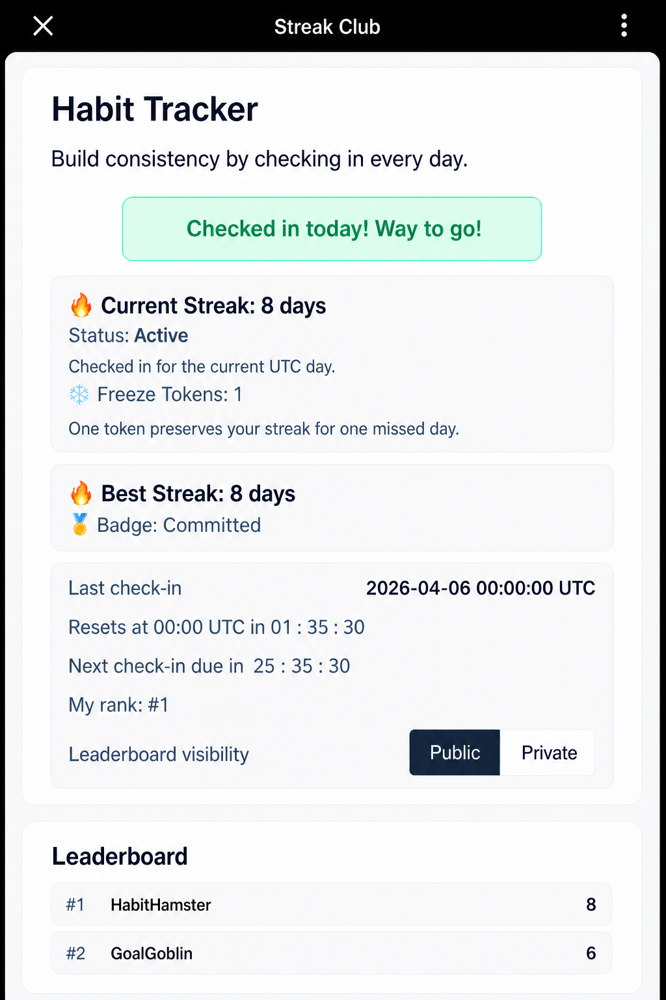
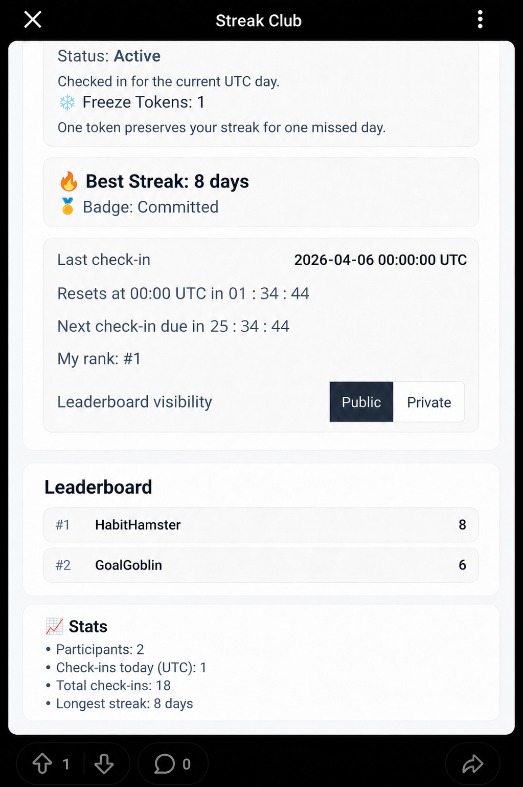

# Streak Club

Turn your subreddit into a daily habit engine.

Streak Club is a pinned, interactive post that keeps your community coming back every day. Members check in once per day, build streaks, and stay motivated through accountability, gamification, and friendly competition.

Perfect for fitness, coding, studying, journaling, or breaking negative habits — any goal-driven community.

  
  

---

## 🚀 Why Mods Use Streak Club

- **Increase daily engagement** — give members a reason to return every day  
- **Build accountability** — public streaks create positive pressure  
- **Strengthen community culture** — shared goals bring members together  
- **Make progress visible** — streaks, badges, and leaderboards reinforce consistency  
- **Turn habits into a game** — simple actions, rewarding feedback  

Streak Club transforms passive communities into active, goal-oriented ones.

---

## 🧩 How It Works

• Members join the challenge  
• Check in once per UTC day (resets at 00:00 UTC)  
• Build a daily streak  
• Earn Freeze Tokens every 7 days (protect against a missed day)  
• Unlock milestone badges  
• Climb the leaderboard (or stay private)

Miss a day?  
A Freeze Token can save your streak — but only if you’ve earned it.

---

## 🎯 Core Features

- Daily UTC check-in system
- Streak tracking with automatic progression
- Freeze Tokens (streak protection)
- Milestone badges (7, 30, 90, 180, 365)
- Public leaderboard with privacy toggle
- Privacy toggle (public / private)
- Social proof stats (participants, check-ins, streaks)
- Single active tracker per subreddit (simple + focused)

---

## 🛠️ Moderator Setup

1. Add Streak Club to your subreddit  
2. Create the tracker post  
3. Pin the post  
4. Invite your community to start their streak  

That’s it — the system runs automatically.

---

## 💡 Best Use Cases

- Fitness challenges (daily workouts, steps, gym)
- Coding streaks (build every day)
- Study/accountability groups
- Writing or journaling
- Habit building communities
- Habit-breaking communities and personal accountability challenges

If your subreddit is about **doing something consistently — or not doing something —** Streak Club fits.

---

## ❓ FAQ

**What time does it reset?**  
00:00 UTC.

**What happens if someone misses a day?**  
Their streak resets unless they have a Freeze Token.

**Can users stay private?**  
Yes — private users are hidden from the leaderboard.

---

## Support

If you have questions, feedback, or issues with Streak Club, please contact the developer through Reddit or open an issue in the project repository if available.

---

## Data & Privacy

Streak Club stores only the information needed to run the tracker, including participation status, check-in history, streak counts, Freeze Tokens, leaderboard visibility, and subreddit-level tracker settings.

Users can choose whether they appear on the public leaderboard using the privacy toggle. Private users are excluded from the public leaderboard.

---

## Changelog

### Pending / Next Public Release

- Added README screenshots showing the tracker experience
- Updated README presentation for moderators evaluating the app

### 0.0.36 — Current Public Release

- Fixed the “Create/Open Streak Club Tracker” subreddit menu action
- Improved tracker post URL handling for Reddit post IDs
- Preserved existing tracker create/open/recovery behavior
- Added integration test coverage for tracker creation and recovery

### Initial Public Release

- Daily UTC check-ins
- Streak tracking
- Freeze Tokens
- Milestone badges
- Public leaderboard with privacy toggle
- Moderator setup tools
- Social proof stats

Built with Devvit.

